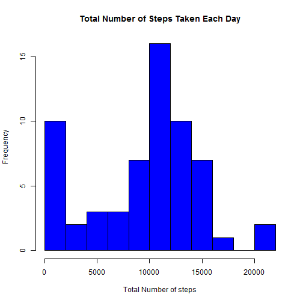
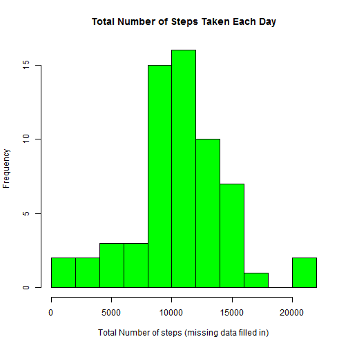

Reproducible Research: Peer Assessment 1
========================================================

# Introduction
## This assignment makes use of data from a personal activity monitoring device. This device collects data at 5 minute intervals through out the day. The data consists of two months of data from an anonymous individual collected during the months of October and November, 2012 and include the number of steps taken in 5 minutes interval each day.

# Load of libraries required for this assignment

```r
require(reshape2)
library(plyr)
library(ggplot2)
library(knitr)
library(lubridate)
library(timeDate)
library(data.table)
```

# Loading and preprossessing the data
# the data for this assignment was downloaded from the website and the variable included in this dataset are:
. steps: Number of steps taking in a 5-minute interval (missing values are coded as NA)
. date: The date on which the measurement was taken in YYYY-MM-DD format
. interval: Identifier for the 5-minutes interval in which measurement was taken

```r
df<-read.csv("activity.csv", header = TRUE, na.string="NA", sep = ",",colClasses =c("numeric","Date","numeric"))

head(df)
```

```
##   steps       date interval
## 1    NA 2012-10-01        0
## 2    NA 2012-10-01        5
## 3    NA 2012-10-01       10
## 4    NA 2012-10-01       15
## 5    NA 2012-10-01       20
## 6    NA 2012-10-01       25
```

# What is mean total number of steps taken per day?

```r
#1.Historgram of total number of steps taken each day


df_sum<-aggregate(df$steps,list(df$date), sum, na.rm=TRUE)

hist(df_sum$x,xlab="Total Number of steps",breaks =10, main = "Total Number of Steps Taken Each Day", col="Blue")
```

 

```r
#2. Calculation and report of Mean and Median of the total number of steps taken per day


day_mean<-ddply(df, ~date, summarise, mean=mean(steps, na.rm=TRUE))
day_median<-ddply(df, ~date, summarise, median=median(steps, na.rm=TRUE))

# Calculate and report the mean/median of total steps across all days

df_mean<-mean(df_sum$x)
df_mean
```

```
## [1] 9354.23
```

```r
df_median<-median(df_sum$x)
df_median
```

```
## [1] 10395
```
# What is the average daily activity pattern ?

```r
#1. A time series plot (i.e. type = "l") of the 5-minute interval(x-axis) and the average number of steps taken, averaged across all days (y-axis)


interval_mean<-aggregate(df$steps,list(df$interval), sum, na.rm=TRUE)
names(interval_mean)<-c("interval","averaged_steps")

ggplot(interval_mean, aes(interval, averaged_steps)) + geom_line(size=1, colour="#000099") + ggtitle("Average Daily Activity") + xlab("5-minute Interval") + ylab("Average Number Of steps") + theme(panel.background = element_rect(fill = 'white', colour = 'black'))
```

 

```r
#2. 5-minute interval, on average across all the days in the dataset, containing the maximum number of steps

df_max= which.max(interval_mean$averaged_steps)
df_max
```

```
## [1] 104
```
# Inputing missing values

```r
## 1. Calculate and report the total number of missing values in the dataset (i.e. the total numbers of rows with NAs)

nrows_NA<-nrow(df)
nrows_NoNA<-nrow(na.omit(df))
Tot_NA<-nrows_NA-nrows_NoNA
Tot_NA
```

```
## [1] 2304
```

```r
## 2. Strategy for filing in all missing values in the dataset

## fill_NA is a function that fill in the missing NA values with the median total number of steps taken per day

fill_NA=function(x){ 
  #first convert each column into numeric if it is from factor
  x<-as.numeric(as.character(x))
  
  #convert the item with NA value to median value from the column
  x[is.na(x)] = day_mean$mean
  
  #display the column
  x  
  } 


## 3. New dataset that is equal to the original dataset but with missing data field in.

#dfnew is the new dataset
dfnew<-df
dfnew$steps<-fill_NA(dfnew$steps)
```

```
## Warning in x[is.na(x)] = day_mean$mean: number of items to replace is not
## a multiple of replacement length
```

```r
## 4. Histogram of the total number of steps taken each day and calculate and report the mean and median total number of steps taken per day.

dfnew_sum<-aggregate(dfnew$steps,list(dfnew$date), sum, na.rm=TRUE)
names(dfnew_sum)<-c("date","averaged_steps")


hist(dfnew_sum$averaged_steps,xlab="Total Number of steps (missing data filled in)",breaks = 10,main = "Total Number of Steps Taken Each Day", col="green")
```

 

```r
# Calculate and report the mean and median total number of steps taken per day
dfnew_mean<-mean(dfnew_sum$averaged_steps)
dfnew_mean
```

```
## [1] 10579.05
```

```r
dfnew_median<-median(dfnew_sum$averaged_steps)
dfnew_median
```

```
## [1] 10395
```

```r
# Do these values differ from the estimates from the first part of the assignment ?
## Yes, these values differ from the estimates from the first part of the assignment, xxxxx.

# What is the impact of imputing missing data on the estimates of the total daily number of steps ?
```
# Are there differences in activty pattern between weekdays and weekends ?

```r
## 1. Create a new factor variable in the dataset with two levels -- "weekday" and "weekend" indicating whether a given date is a weekday or weekend day.


factday<- function(data) {
  if (weekdays(as.Date(df$date)) %in% c('Saturday','Sunday')) {
    "Weekend"
    
    }
  else {
    "Weekday"
    }
  }


#dfnew$factday<-sapply(dfnew$date, FUN=factday)


## 2. Make a panel plot containing a time series plot (i.e. type = "l") of the 5-minute interval (x-axis) and the average number of steps taken, averaged across all weekday days or weekend days (y-axix)

ggplot(dfnew_sum, aes(date, averaged_steps)) + facet_grid (. ~date) + geom_line() + xlab("5-minute Interval") + ylab("Number of Steps")
```

```
## geom_path: Each group consist of only one observation. Do you need to adjust the group aesthetic?
## geom_path: Each group consist of only one observation. Do you need to adjust the group aesthetic?
## geom_path: Each group consist of only one observation. Do you need to adjust the group aesthetic?
## geom_path: Each group consist of only one observation. Do you need to adjust the group aesthetic?
## geom_path: Each group consist of only one observation. Do you need to adjust the group aesthetic?
## geom_path: Each group consist of only one observation. Do you need to adjust the group aesthetic?
## geom_path: Each group consist of only one observation. Do you need to adjust the group aesthetic?
## geom_path: Each group consist of only one observation. Do you need to adjust the group aesthetic?
## geom_path: Each group consist of only one observation. Do you need to adjust the group aesthetic?
## geom_path: Each group consist of only one observation. Do you need to adjust the group aesthetic?
## geom_path: Each group consist of only one observation. Do you need to adjust the group aesthetic?
## geom_path: Each group consist of only one observation. Do you need to adjust the group aesthetic?
## geom_path: Each group consist of only one observation. Do you need to adjust the group aesthetic?
## geom_path: Each group consist of only one observation. Do you need to adjust the group aesthetic?
## geom_path: Each group consist of only one observation. Do you need to adjust the group aesthetic?
## geom_path: Each group consist of only one observation. Do you need to adjust the group aesthetic?
## geom_path: Each group consist of only one observation. Do you need to adjust the group aesthetic?
## geom_path: Each group consist of only one observation. Do you need to adjust the group aesthetic?
## geom_path: Each group consist of only one observation. Do you need to adjust the group aesthetic?
## geom_path: Each group consist of only one observation. Do you need to adjust the group aesthetic?
## geom_path: Each group consist of only one observation. Do you need to adjust the group aesthetic?
## geom_path: Each group consist of only one observation. Do you need to adjust the group aesthetic?
## geom_path: Each group consist of only one observation. Do you need to adjust the group aesthetic?
## geom_path: Each group consist of only one observation. Do you need to adjust the group aesthetic?
## geom_path: Each group consist of only one observation. Do you need to adjust the group aesthetic?
## geom_path: Each group consist of only one observation. Do you need to adjust the group aesthetic?
## geom_path: Each group consist of only one observation. Do you need to adjust the group aesthetic?
## geom_path: Each group consist of only one observation. Do you need to adjust the group aesthetic?
## geom_path: Each group consist of only one observation. Do you need to adjust the group aesthetic?
## geom_path: Each group consist of only one observation. Do you need to adjust the group aesthetic?
## geom_path: Each group consist of only one observation. Do you need to adjust the group aesthetic?
## geom_path: Each group consist of only one observation. Do you need to adjust the group aesthetic?
## geom_path: Each group consist of only one observation. Do you need to adjust the group aesthetic?
## geom_path: Each group consist of only one observation. Do you need to adjust the group aesthetic?
## geom_path: Each group consist of only one observation. Do you need to adjust the group aesthetic?
## geom_path: Each group consist of only one observation. Do you need to adjust the group aesthetic?
## geom_path: Each group consist of only one observation. Do you need to adjust the group aesthetic?
## geom_path: Each group consist of only one observation. Do you need to adjust the group aesthetic?
## geom_path: Each group consist of only one observation. Do you need to adjust the group aesthetic?
## geom_path: Each group consist of only one observation. Do you need to adjust the group aesthetic?
## geom_path: Each group consist of only one observation. Do you need to adjust the group aesthetic?
## geom_path: Each group consist of only one observation. Do you need to adjust the group aesthetic?
## geom_path: Each group consist of only one observation. Do you need to adjust the group aesthetic?
## geom_path: Each group consist of only one observation. Do you need to adjust the group aesthetic?
## geom_path: Each group consist of only one observation. Do you need to adjust the group aesthetic?
## geom_path: Each group consist of only one observation. Do you need to adjust the group aesthetic?
## geom_path: Each group consist of only one observation. Do you need to adjust the group aesthetic?
## geom_path: Each group consist of only one observation. Do you need to adjust the group aesthetic?
## geom_path: Each group consist of only one observation. Do you need to adjust the group aesthetic?
## geom_path: Each group consist of only one observation. Do you need to adjust the group aesthetic?
## geom_path: Each group consist of only one observation. Do you need to adjust the group aesthetic?
## geom_path: Each group consist of only one observation. Do you need to adjust the group aesthetic?
## geom_path: Each group consist of only one observation. Do you need to adjust the group aesthetic?
## geom_path: Each group consist of only one observation. Do you need to adjust the group aesthetic?
## geom_path: Each group consist of only one observation. Do you need to adjust the group aesthetic?
## geom_path: Each group consist of only one observation. Do you need to adjust the group aesthetic?
## geom_path: Each group consist of only one observation. Do you need to adjust the group aesthetic?
## geom_path: Each group consist of only one observation. Do you need to adjust the group aesthetic?
## geom_path: Each group consist of only one observation. Do you need to adjust the group aesthetic?
## geom_path: Each group consist of only one observation. Do you need to adjust the group aesthetic?
## geom_path: Each group consist of only one observation. Do you need to adjust the group aesthetic?
```

 

# Submitting the Assignment
## 1. Committed my PA1_template.Rmd file to the master branch of my git repository
## 2. Committed my PA1_template.md and PA1_template.html files produced by processing my R markdown file with knit2html() function in R by running it from my Rstudio console
## 3. Placed all figures in the figure/directory
## 4. pushed the master branch to GitHub
## 5. Submitted the URL to my GitHub repository for this assignment on the course website
## finally, submitted the 40 character SHA-1 hash on the course website


