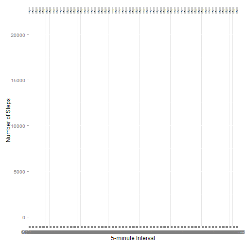

Title
========================================================

This is an R Markdown document. Markdown is a simple formatting syntax for authoring web pages (click the **Help** toolbar button for more details on using R Markdown).

When you click the **Knit HTML** button a web page will be generated that includes both content as well as the output of any embedded R code chunks within the document. You can embed an R code chunk like this:

# Loading and preprossessing the data

```r
echo = TRUE
df<-read.csv("activity.csv", header = TRUE, sep = ",")
```

# What is mean total number of steps taken per day?

```r
dfNoNA<-df[!is.na(df)]

plot(df$steps, type = "h", col = "red", lwd = 10)
```

 

